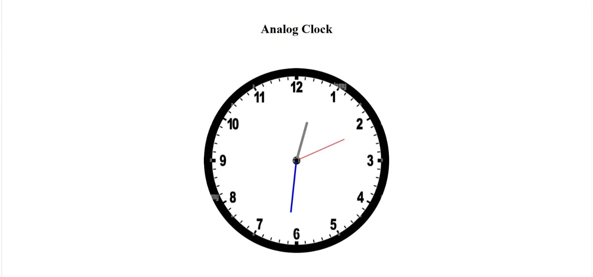

# ⏰ Analog Clock (HTML, CSS, JavaScript)

## 📌 Project Description

This is a simple **Analog Clock Web App** built using **HTML, CSS, and JavaScript**.
It displays real-time hours, minutes, and seconds with smooth rotation.

---

## 🚀 Features

* Real-time clock ⏱️
* Smooth hand rotation
* Clean UI design
* Responsive layout

---

## 🛠️ Technologies Used

* HTML
* CSS
* JavaScript

---

## 📂 Project Structure

```
Analog-Clock/
│── index.html
│── style.css
│── script.js
│── screenshot.png
```

---

## 📸 Screenshot Preview



---

## ▶️ How to Run

1. Download or clone this project
2. Open `index.html` in your browser
3. Enjoy the working analog clock 🎉

---

## ⚙️ How It Works

* JavaScript gets current time using `Date()`
* Converts time into rotation angles
* CSS rotates clock hands using `transform: rotate()`

---

## 💡 Future Improvements

* Add digital clock
* Add dark mode 🌙
* Add timezone support
* Add ticking sound 🔊

--

---

## ⭐ If you like this project

Give it a ⭐ on GitHub and share with others!
